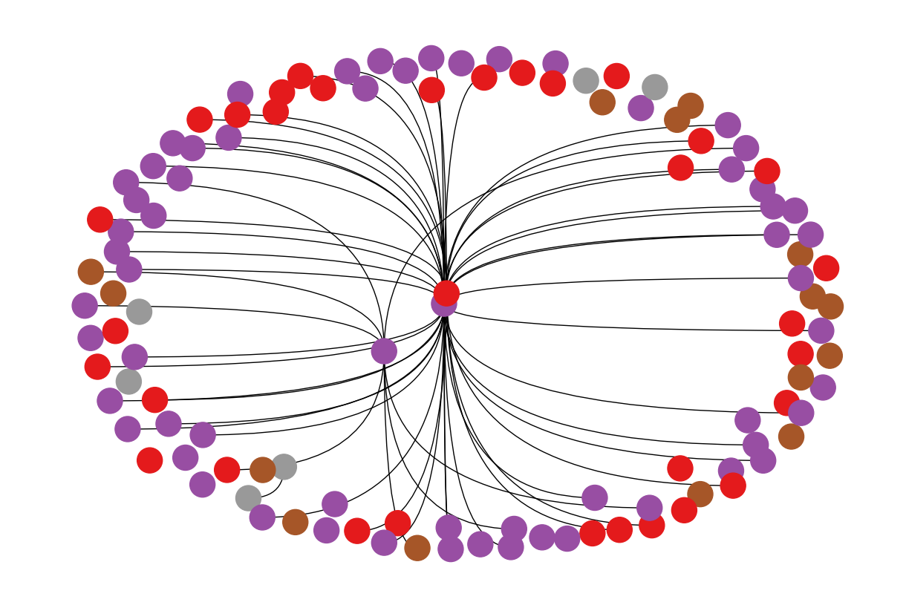

# Graph Neural Network Implementioan

## Overview

This project focuses on implementing a robust classification system for identifying the types of Facebook posts within the Musae Facebook dataset. The classification is achieved through the application of Graph Neural Networks (GNNs), leveraging their ability to capture complex relationships within the data.

## VISUALISATION

## Results

## Data

 - [Source: https://snap.stanford.edu/data/]( http://cricsheet.org/ )

## ACKNNOWLEDGMENSTS
(https://awadrahman.medium.com/hands-on-graph-neural-networks-for-social-network-using-pytorch-30231c130b38)
